🌎 **Languages**
- 🇺🇸 [English](../README.md)
- 🇧🇷 Português (página atual)

# 👋Olá! Eu sou José Luiz ( mas me chama de Junior 😅)

- 👨🏻‍💻 Comecei a trabalhar como desenvolvedor em 2010.
- 💻 Minha stack principal é Java, mas já trabalhei com Scala, Kotlin, Node, Python e C#.
- 👀 Já atuei como Fullstack usando Angular e React, além de desenvolvimento mobile com Xamarin.Forms.
- 💿 Conhecimento sólido com bancos SQL e já trabalhei com NoSQL (MongoDB, DynamoDB).
- 🧐 Tenho curiosidade em conhecer stacks diferentes e mantenho alguns projetos em várias tecnologias (ex.: Ruby, React Native, Vue).

## 👨🏻‍🎓 Formações
 - **Graduação:** FATEC Guaratinguetá - Tecnologia em Informática com Ênfase em Banco de Dados, Agosto de 2009 - Agosto de 2012.
 - **Pós Graduação:** FATEA - Especialização em Projeto e Desenvolvimento de Aplicações Web, Março de 2014 - Setembro de 2015.
 - **Pós Graduação:** FIAP - IA para Desenvolvedores, Março de 2025 - Março de 2026.

## 👾 Stacks

### 💪🏻 Principal:

  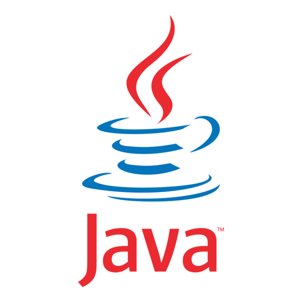
  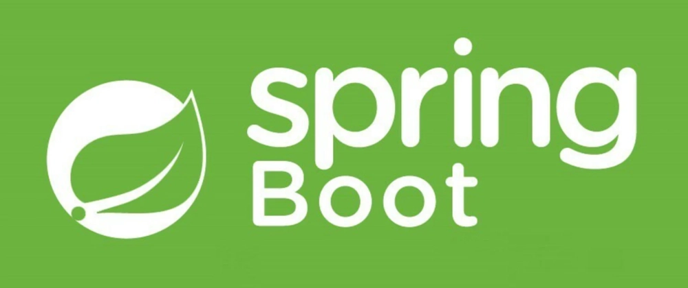

(Versões do Java: 8, 11, 17, 21 e 25)

### 👍🏻 Já utilizadas em oportunidades:

  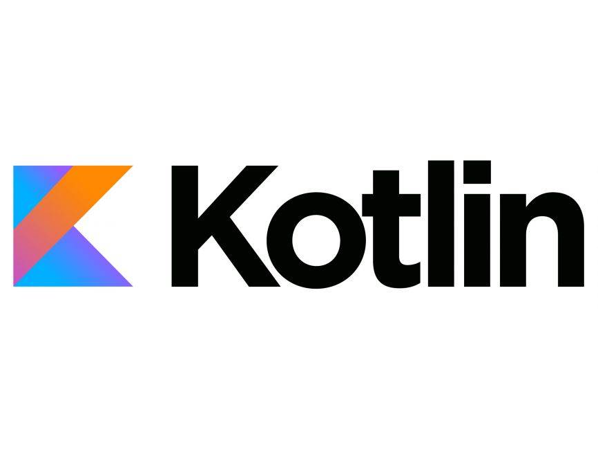
  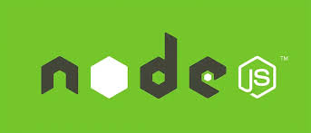
  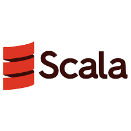
  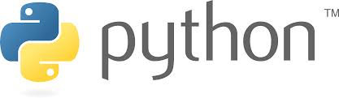
  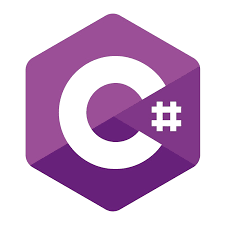
  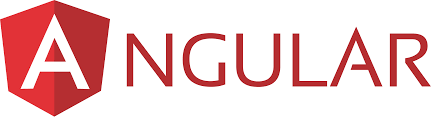
  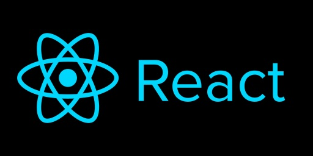

### 🧠 Sem experiência mas já estudei:

  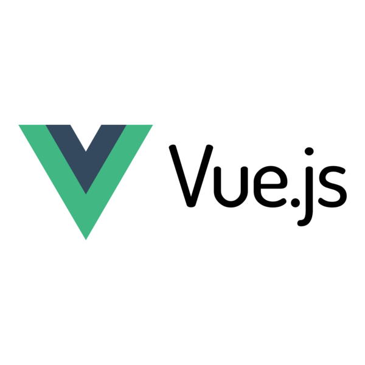
  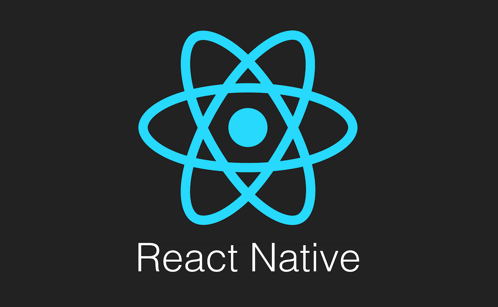
  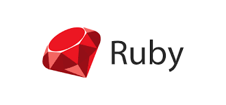

## 💼 Empresas onde já trabalhei:

  <a href="https://www.embraer.com/">
    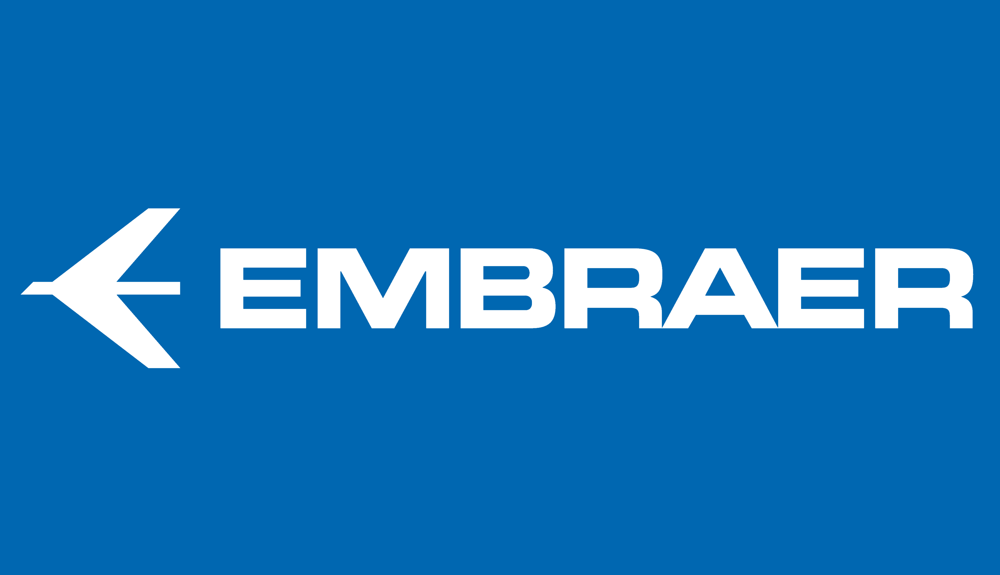
  </a>
  <a href="https://picpay.com">
    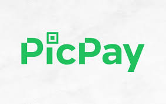
  </a>
  <a href="https://www.caju.com.br/">
    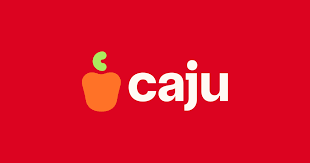
  </a>
  <a href="https://rdsaude.com.br">
    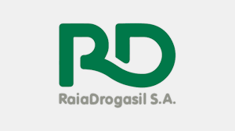
  </a>
  <a href="https://www.amedigital.com">
    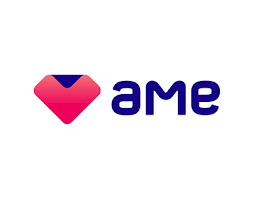
  </a>
    </a>
      <a href="https://www.amedigital.com">
      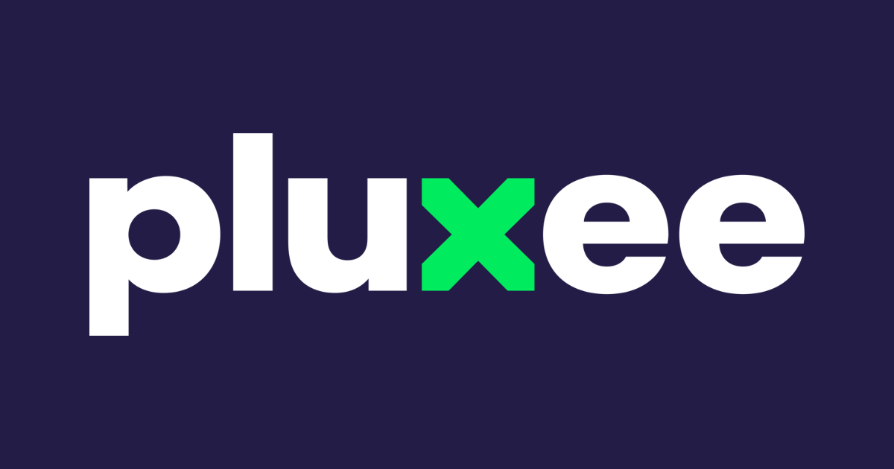
    </a>

---
📫 Fique à vontade para explorar meus repositórios ou entrar em contato.

